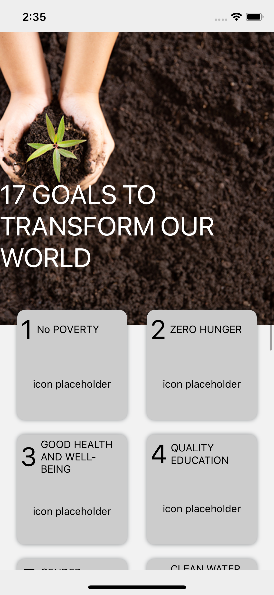
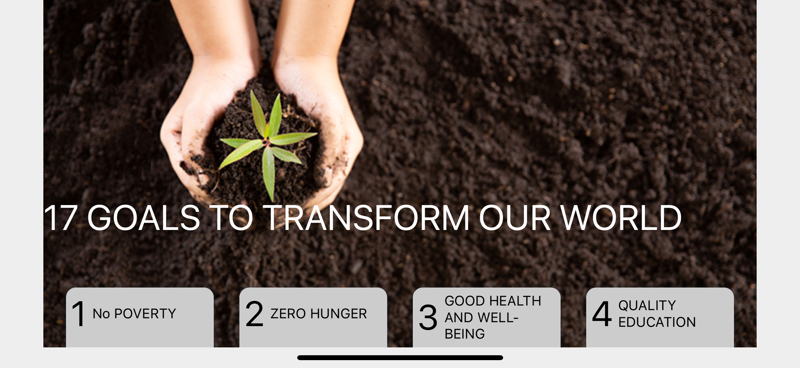
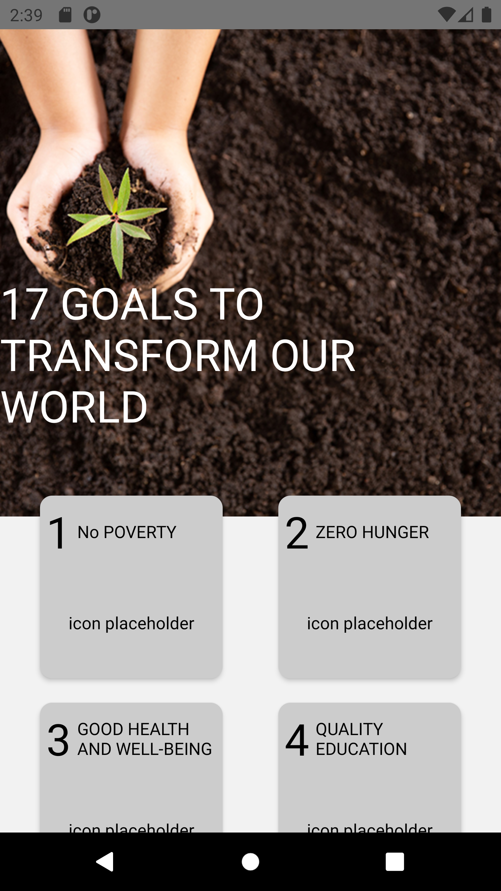
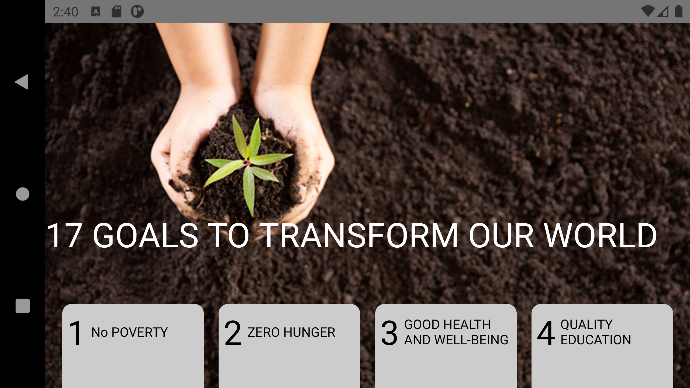

# Sustainable Development Goals (SDGs) application

SDGs app is used for

- view current sustainable development goals (SDGs)
- view the targets of each SDG

## Application feature

- <b>Responsive</b>, the application is adaptive to the orientation of the device as well as the size of the device, i.e. the wider your device is, more SDG is shown in one row.

<figure>
  
  <figcaption>iOS portrait</figcaption>
</figure>

<figure>
  
  <figcaption>iOS landscape</figcaption>
</figure>

- <b>Cross-platform</b> the application works in iOS as well as in android device.

<figure>
  
  <figcaption>Android portrait</figcaption>
</figure>

<figure>
  
  <figcaption>Android landscape</figcaption>
</figure>

## Tech Stack

- [React](https://reactjs.org/)
- [React Native](https://reactnative.dev/)
- [Redux](https://redux.js.org/) for state management
- [React Navigation 5.x](https://reactnavigation.org/) for screen navigation
- [Jest](https://jestjs.io/) for unit testing
- [detox](https://github.com/wix/Detox) for end-to-end testing
- [React Native debugger](https://github.com/jhen0409/react-native-debugger) for development purpose (inspect network traffic, React Navigation state changes, Redux action and state changes)

## Discussion

- use of redux   the use of redux is overkill for SDG application. The same functionalities can be achieved by using stateful components or useState hooks or even context. However, setting up the redux is benefifical in the future if the application needs to grow larger. The benefits include easy to handle async request using redux thunk, use memorized the selector using reselect, update complicated state and enforce immutability using Immutable, use React debugger to monitor the state changes and network traffic etc.

- strcutre of redux state   the current redux state of application is straight forward. if the global state becomes larger and there are relational data in the state, redux state needs to be normalized (see [how](https://redux.js.org/recipes/structuring-reducers/normalizing-state-shape))

## Things to improve

- more test coverage   due to the time limit, the tests for ths project are limits (unit tests only covers all the components, redux actions and reducers)

- better layout design.

## Prerequisites

- Node.js
- Xcode
- detox for running detox
- Android emulator (if you want to run the app on Android emulator)

## How to run the application on an ios simulator

Go to the root directory of the project and run

`yarn install` or `npm install`

to install all the dependencies and then run

`cd ios && pod install && cd ..`

to install all the Pods

run

`npm run ios`

to launch the application with default simulator or run

`npm run ios --simulator \${SIMULATOR_NAME}`

to run the application on a specific platform.

## How to run the application on Android emulator

Before you run the application on Android emulator, make sure you have downloaded a virtual device on Android Studio, please refer to the online guides: i.e.

<https://medium.com/@wnyao0830/run-create-react-native-app-on-android-studios-emulator-ad678a0c362f>

please run

`npm run android`

## how to run the tests

for unit tests, please run

`npm run test`

Launches the test runner in the interactive watch mode.
See the section about [running tests](https://facebook.github.io/create-react-app/docs/running-tests) for more information.

for end-to-end tests, please run

`npm run e2e`

please note you need to have detox setup in your computer, see [detox introduction](https://github.com/wix/Detox/blob/master/docs/Introduction.GettingStarted.md)

## Authors

- **Chao Wang**
